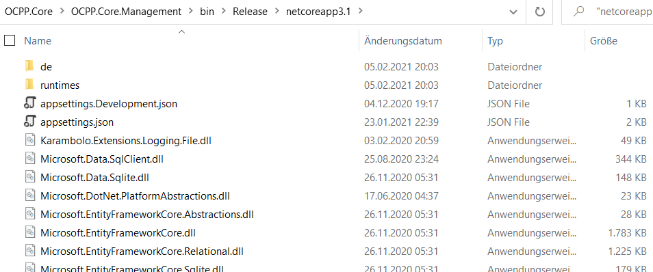
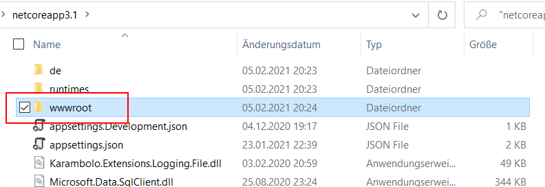

# OCPP.Core Build & Installation

OCPP.Core consists of three projects:
 - OCPP.Core.Server 
 - OCPP.Core.Management
 - OCPP.Core.Database

The "Server" is the web application the charge stations are communicating with.  It understands the OCP-Protocol  and it has a small REST-API for the Management UI.

The "Management" is the Web-UI you can open in the browser. You can manage the charge stations and RFID-tokens there. And of course you can see and download the charge-transaction lists there.

The "Database" is used by both other projects. It contains the necessary Code for reading & writing data from/into the database.

## Database
The project includes templates for SQL-Server and SQLite:

	* SQL-Server (SQL-Express)
	Use the script in the folder 'SQL-Server' to create a new database.
	Configure your account (IIS => AppPool) for reading and writing data.
		
	* SQLite
	The folder 'SQLite' contains an empty ready-to-use database file. Or you use the SQL script in the same folder.

The main Script in both folders always contain the latest version for a full database. If you are updating from previous versions there are dedicated update skripts.

## Webserver
The OCPP-Server and the Web-UI are independent webs/servers and both need database connection information. The Web-UI needs the the URL to the OCPP server for status information and some actions. The config file of the Web-UI contains the users and passwords.

**OCPP.Core.Server**
Edit the appsettings.json file and configure the 'SQLite' *or* 'SqlServer' entry:
```
"ConnectionStrings": {
	//"SQLite": "Filename=.\\..\\SQLite\\OCPP.Core.sqlite;"
	"SqlServer": "Server=.;Database=OCPP.Core;Trusted_Connection=True;"
	},
```
If you configure a dump directory, the server writes all OCPP requests and responses there. You can also log basic message information in the database.
```
"MessageDumpDir": "c:\\temp\\OCPP",
"DbMessageLog": 2,  //0=None, 1=Info, 2=Verbose (all)
```
**OCPP.Core.Management**
See above for the database connection. The appsettings.json file also contains the user logins, passwords and role. Administrators can create and edit chargepoints and tags. Regular users can see the chargepoints and transactions.
```
"Users": [
	{
		"Username": "admin",
		"Password": "t3st",
		"Administrator": true
	},
	{
		"Username": "user",
		"Password": "t3st",
		"Administrator": false
	}
]
```
The Management-UI needs the URL to the OCPP server for internal communication.  To secure this API you can configure API keys (=identical passwords) on both sides:
```
"ServerApiUrl": "http://localhost:8081/API",
"ApiKey": "....",
```


## Quick run with published release
Download a precompiled [release](https://github.com/dallmann-consulting/OCPP.Core/releases).
They are compiled 'portable' and run on different platforms.

### Windows
* Download and install the .NET.Core 3.1 runtime.
* Extract the ZIP file somewhere. 
* Open the file "appsettings.json" in the OCPP.Server and configure "MessageDumpDir" to an existing directory or leave it empty to turn off message dumps.
* Start the "OCPP.Core.Server.exe" and "OCPP.Core.Management.exe". 
* Open "http://localhost:8082" in a browser.

### Linux
* Install the .NET.Core 3.1 runtime for your Linux distribution and version. Instructions [here](https://docs.microsoft.com/en-us/dotnet/core/install/linux).
* Extract the ZIP file somewhere. 
* Open the file "appsettings.json" in both projects
	* change the paths to the sqlite file to a valid unix path: "SQLite": "Filename=./../SQLite/OCPP.Core.sqlite;"
	* Only OCPP.Server: configure the "MessageDumpDir" to an existing directory or leave it empty to turn off message dumps.
* Give the file "SQLite/OCPP.Core.sqlite" Read&Write permissions to everone.
* Start both projects in consoles:
	```
	dotnet OCPP.Core.Server.dll
	```

	```
	dotnet OCPP.Core.Management.dll
	```
* Open "http://localhost:8082" in a browser.


## Build
### Build with Visual Studio
If you use VS you can simply open and the compile the solution. Visual Studio will create the correct file structure in the output directory. It should look something like this:



For deployments you should "publish" each project. Then visual studio will automatically add all necessary files (like "wwwroot" - see below) to the output.

## Build with SDK
Make sure that the [.NET-Core SDK 3.1](https://dotnet.microsoft.com/download/dotnet-core/3.1) is installed.

Open a command shell (cmd) and navigate to the folder where the "OCPP.Core.sln" file is. Then enter the following command to start a debug build:

```dotnet build OCPP.Core.sln``` or
```dotnet publish OCPP.Core.sln```

You will hopefully see that all three projects were compiled without errors. You should then have the same output like the VS-Build (see screenshot above).

# Running

**Run with Kestrel (simple Web-Server)**

The compiler output for the two web projects (Server and Management) contain equally named executables:

```OCPP.Core.Server.exe``` and ```OCPP.Core.Management.exe```

You can simply start (double click) these executables. This will start the applications with the simple [Kestrel Web-Server](https://www.tektutorialshub.com/asp-net-core/asp-net-core-kestrel-web-server/).
You will see a command shell where the active URLs are shown and all logging output.

The appsettings.json files contain the following URL settings for the Kestrel server:

 - OCPP.Server without SSL: "http://localhost:8081" => "ws://localhost:8081/OCPP/<chargepoint-ID>"
 - OCPP.Server with SSL: "https://localhost:8091" => "wss://localhost:8091/OCPP/<chargepoint-ID>"
 - OCPP.Management without SSL: "http://localhost:8082"
 - OCPP.Management with SSL: "https://localhost:8092"
 
 Both projects contain a self-signed certificate (.pfx file) for testing purposes.

***Attention:***

The Management Web-UI contains a few static files in a folder "wwwroot" in the project. Only the "publish" actions will copy these files. Make sure that this folder was copied to the output:



Most components (bootstrap, fontawesome ...) are loaded externally from the internet. So you won't notice any errors. But with the static files missing, you cannot open chargepoints or RFID-Tokens from the table views.

**Run in IIS**

To run an ASP.NET-Core application in IIS you need to install the .NET-Core Hosting Bundle. This is described here:
https://dotnetcoretutorials.com/2019/12/23/hosting-an-asp-net-core-web-application-in-iis/

Then you can create a website or app-folder in IIS and point to the compiler output folder. If you're using SQL-Server and want integrated security you might also need to configure the app pool.
